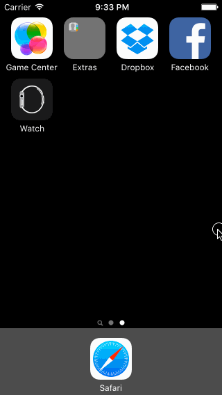

# Dropbox Demo

This is an iPhone demo application showing the welcome flow, create account, sign in, and basic screens of the [Dropbox iOS App](https://www.dropbox.com/mobile). Built using Codepath's [Dropbox  Tutorial](http://courses.codepath.com/courses/ios_for_designers/unit/1#!assignment).

Time spent: 11 hours spent in total

Completed user stories:

 * [x] Required: User can tap through the 3 welcome screens.
 * [x] Required: Uer can follow the create user flow.
 * [x] Required: User can follow the sign in flow.
 * [x] Optional: Optional: You should be able to swipe through the welcome screens instead of just tapping them.
 
Walkthrough of all user stories:

GIF created with [LiceCap](http://www.cockos.com/licecap/).

Welcome screen swipe interaction built using [Ray Wanderlich's How To Use UIScrollView to Scroll and Zoom Content Tutorial](http://www.raywenderlich.com/10518/how-to-use-uiscrollview-to-scroll-and-zoom-content)
